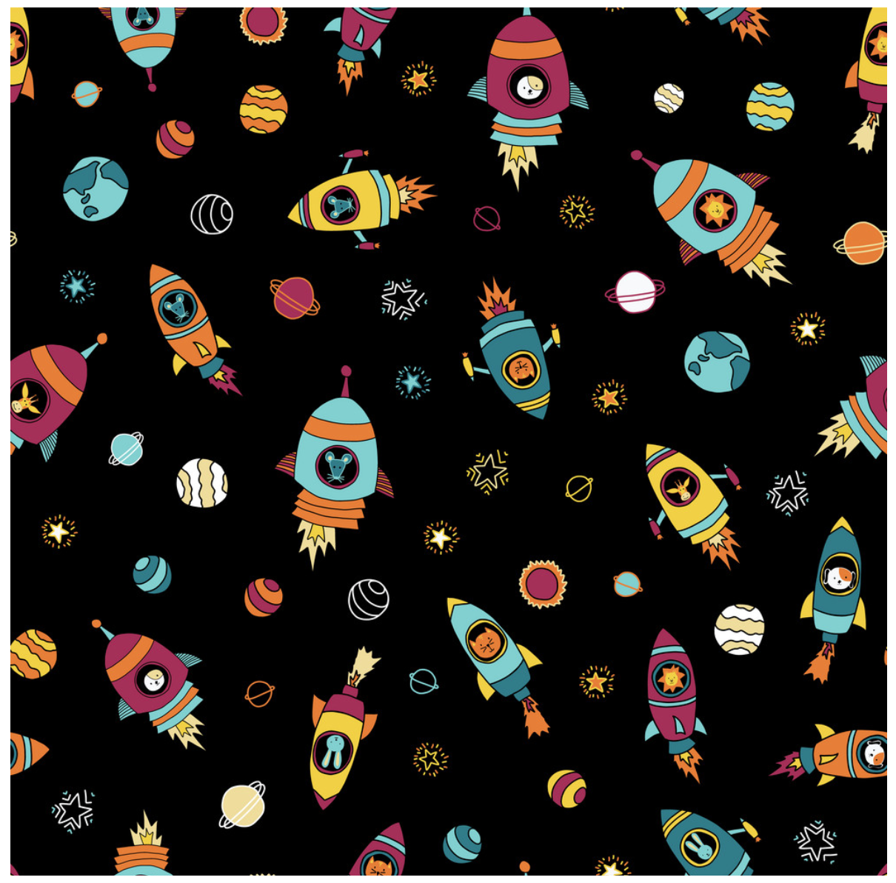
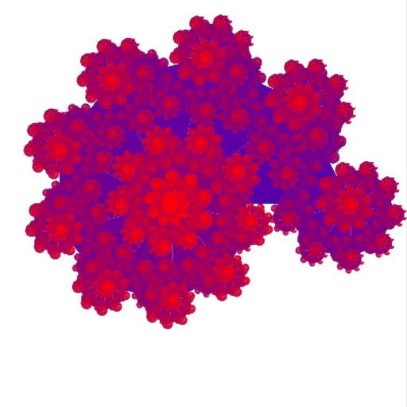
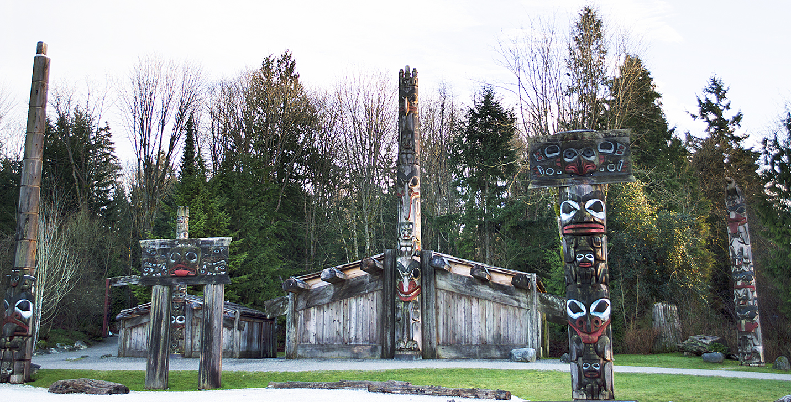
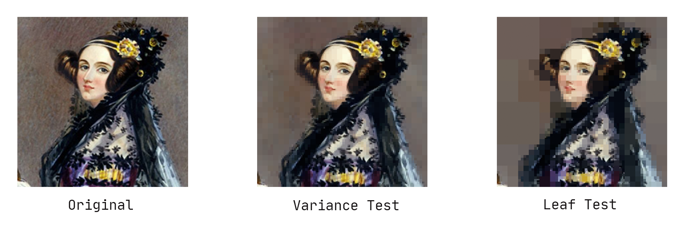
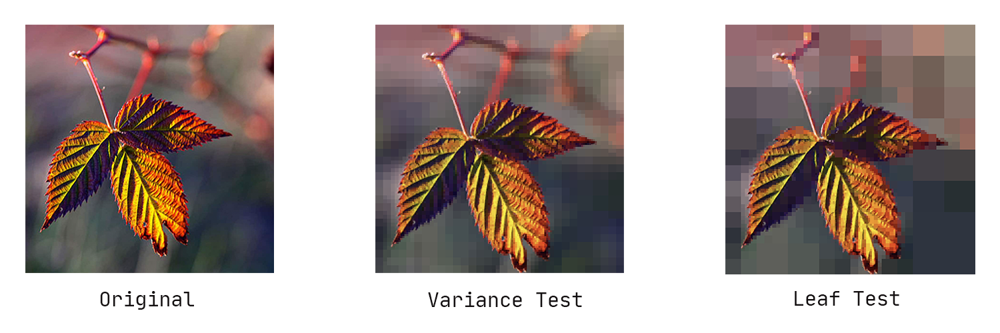
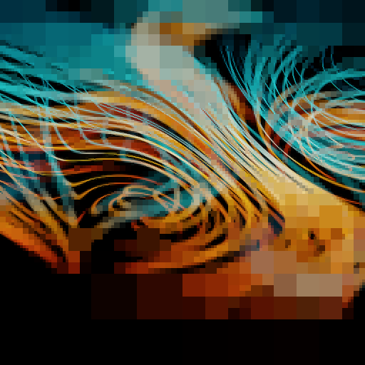
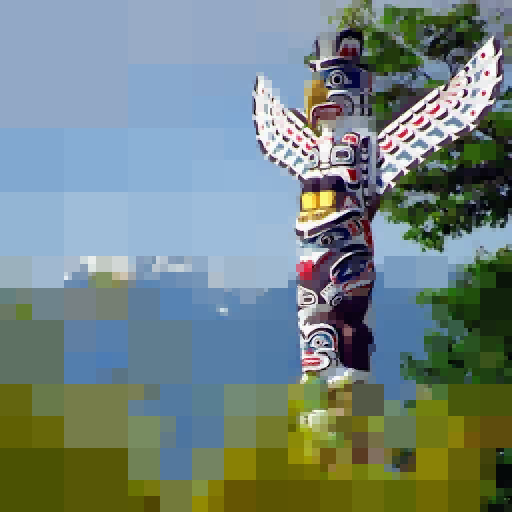
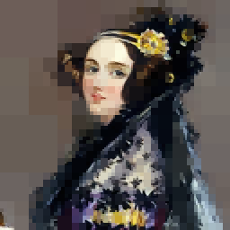

# QuadTree PNG Lossy Image Compression

## orig
```sh
[  124715] orig/adasquare.png
```

```sh
[  715470] orig/ben.png
```

```sh
[  374067] orig/canadaPlace.png
```

```sh
[   72319] orig/colour.png
```

```sh
[     253] orig/geo.png
```

```sh
[  727527] orig/james.png
```

```sh
[  544575] orig/jason.png
```

```sh
[ 1427827] orig/KJVFbig.png
```

```sh
[  883988] orig/leaf.png
```

```sh
[ 3709278] orig/network.png
```

```sh
[      84] orig/oneSmall.png
```

```sh
[      84] orig/oneSquare.png
```

```sh
[  601919] orig/remb.png
```

```sh
[  246018] orig/rosa.png
```

```sh
[ 1104066] orig/scott.png
```

```sh
[      89] orig/smB.png
```

```sh
[  874048] orig/spaceShips.png
```

```sh
[  485063] orig/stanley-totem-poles.png
```

```sh
[  189820] orig/trispiral.png
```

```sh
[      93] orig/twoSquares.png
```

```sh
[ 1090241] orig/ubc2.png
```

```sh
[  578089] orig/ubc3.png
```

```sh
[10929496] orig/ubc.png
```

```sh
[ 2171302] orig/ubc-totem-poles.png
```


## out
```sh
[456634] out/Ada.png
```

```sh
[ 53589] out/given-adaPrune-var.png
```

```sh
[443560] out/leaf.png
```

```sh
[ 71890] out/output-benpruned.png
```

```sh
[ 80641] out/output-benpruned-var.png
```

```sh
[ 43794] out/output-comp-count-stanley.png
```

```sh
[ 44265] out/output-comp-var-stanley.png
```

```sh
[175439] out/output-networkpruned.png
```

```sh
[ 16178] out/output-prunedadasquare.png
```

```sh
[ 32180] out/output-prunedadasquare-var.png
```

```sh
[ 77456] out/output-prunedKJVFbig.png
```

```sh
[215470] out/output-prunedKJVFbig-var.png
```

```sh
[ 52396] out/output-prunednetwork.png
```

```sh
[ 49445] out/output-prunednetwork-var.png
```

```sh
[121500] out/output-prunedstanley-totem-poles-square.png
```

```sh
[178041] out/output-prunedstanley-totem-poles-var.png
```

```sh
[ 62638] out/output-prunedubc.png
```

```sh
[ 47610] out/output-prunedubc-var.png
```

```sh
[ 28909] out/output-scottpruned.png
```

```sh
[ 50978] out/output-scottpruned-var.png
```


## soln
```sh
[ 35030] soln/given-adaPrune-count.png
```

```sh
[ 53589] soln/given-adaPrune-var.png
```

```sh
[ 43794] soln/given-comp-count-stanley.png
```

```sh
[ 44265] soln/given-comp-var-stanley.png
```

```sh
[ 16178] soln/given-prunedadasquare.png
```

```sh
[ 32180] soln/given-prunedadasquare-var.png
```

```sh
[ 77456] soln/given-prunedKJVFbig.png
```

```sh
[215470] soln/given-prunedKJVFbig-var.png
```

```sh
[121500] soln/given-prunedstanley-totem-poles.png
```

```sh
[178041] soln/given-prunedstanley-totem-poles-var.png
```

